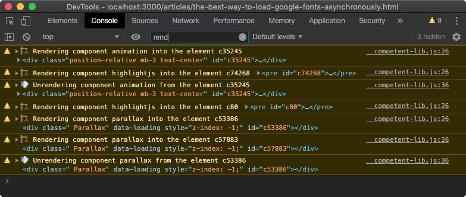

# competent

[](https://www.npmjs.com/package/competent)

`competent` Extracts, Renders And Exports For Dynamic Render _JSX_ Components From Within HTML.

```sh
yarn add competent
```

## Table Of Contents

- [Table Of Contents](#table-of-contents)
- [API](#api)
- [`competent(components, config=): !_restream.Rule`](#competentcomponents-objectstring-functionfunctionnew-preactcomponentconfig-config-_restreamrule)
  * [`Config`](#type-config)
  * [`Meta`](#type-meta)
- [Additional Methods](#additional-methods)
  * [`CompetentComponent`](#type-competentcomponent)
- [`DEBUG=competent`](#debugcompetent)
- [`makeComponentsScript(components, options=): string`](#makecomponentsscriptcomponents-arrayexportedcomponentoptions-makecompsconfig-string)
  * [`MakeCompsConfig`](#type-makecompsconfig)
  * [`IOOptions`](#type-iooptions)
  * [`ExportedComponent`](#type-exportedcomponent)
  * [Assets](#assets)
  * [Intersection Observer](#intersection-observer)
    * [Unrender](#unrender)
- [`async writeAssets(path): void`](#async-writeassetspath-string-void)
- [Known Limitations](#known-limitations)
- [Who Uses _Competent_](#who-uses-competent)
- [License & Copyright](#license--copyright)

<p align="center"><a href="#table-of-contents">
  
</a></p>

## API

The package is available by importing its default and named functions:

```js
import competent, { makeComponentsScript, writeAssets } from 'competent'
```

<p align="center"><a href="#table-of-contents">
  
</a></p>

## <code><ins>competent</ins>(</code><sub><br/>&nbsp;&nbsp;`components: !Object<string, !Function|function(new: preact.Component)>,`<br/>&nbsp;&nbsp;`config=: !Config,`<br/></sub><code>): <i>!_restream.Rule</i></code>
Creates a rule for _Replaceable_ from the `restream` package that replaces HTML with rendered JSX components. The configuration object will be needed to export components, so that they can then be rendered on the page using JavaScript.

 - <kbd><strong>components*</strong></kbd> <em><code>!Object&lt;string, (!Function \| function(new: <a href="https://github.com/externs/preact/wiki/Component" title="A base class that is usually subclassed to create stateful Preact components.">preact.Component</a>))&gt;</code></em>: Components to extract from HTML and render using _Preact's_ server-side rendering. Can be either a functional stateless component, or a _Preact_ component constructor.
 - <kbd>config</kbd> <em><code><a href="#type-config" title="Options for the program. All functions will be called with the Replaceable instance as their `this` context.">!Config</a></code></em> (optional): Options for the program. All functions will be called with the _Replaceable_ instance as their `this` context.

<table>
<tr><th>Example Usage</th></tr>
<tr><td>

```html
<html lang="en">

<npm-package style="background:red;">splendid</npm-package>
<npm-package style="background:green;">@a-la/jsx</npm-package>
<npm-package style="background:grey;">unknown-package</npm-package>

<hello-world from="Art Deco">
  An example usage of competent.
</hello-world>
<friends count="10"/>
</html>
```
</td></tr>
<tr><td>
For example, the above HTML page can be rendered with <em>Competent</em> by creating a <em>Replaceable</em> rule:
</td></tr>
<tr><td>

```jsx
import competent from 'competent'
import aqt from '@rqt/aqt'
import read from '@wrote/read'
import { Replaceable } from 'restream'

/**
 * A standard JSX component.
 */
const HelloWorld = ({ from, children, competent: c }) => {
  c.setPretty(false)
  return (<p>Hello World From {from}.{children}</p>)
}

/**
 * A string component.
 */
const FriendCount = ({ count }) => {
  return `You have ${count} friends.`
}

/**
 * An async component.
 */
const NpmPackage = async ({ style, children, competent: c }) => {
  c.export()
  let [pck] = children
  pck = encodeURIComponent(pck)
  const { statusCode, body } =
    await aqt('https://registry.npmjs.com/' + pck)
  if (statusCode == 404) throw new Error(`Package ${pck} not found.`)
  const { name, versions, description } = body
  const keys = Object.keys(versions)
  const version = keys[keys.length - 1]
  return <div style={style}>
    <span className="name">{name}</span>
    <span className="ver">{version}</span>
    <p>{description}</p>
  </div>
}

const CompetentExample = async () => {
  let i = 0
  const exported = []
  const file = await read('example/index.html')
  const rule = competent({
    'hello-world': HelloWorld,
    'npm-package': NpmPackage,
    'friends': FriendCount,
  }, {
    getId() {
      i++
      return `c${i}`
    },
    getProps(props, meta) {
      meta.setPretty(true, 60)
      return { ...props, competent: meta }
    },
    onFail(key, err) {
      console.error('Component %s did not render:', key)
      console.error(err.message)
    },
    markExported(key, id, props, children) {
      exported.push({ key, id, props, children })
    },
  })
  const r = new Replaceable(rule)
  const res = await Replaceable.replace(r, file)
  return { res, exported }
}

export default CompetentExample
```
</td></tr>
<tr><td>
The output will contain rendered <strong>JSX</strong>.
</td></tr>
<tr><td>

```html
<html lang="en">

<div style="background:red;" id="c1">
  <span class="name">splendid</span>
  <span class="ver">1.12.9</span>
  <p>
    Static Web Site Compiler That Uses Closure Compiler For JS Bundling And Closure Stylesheets For CSS optimisations. Supports JSX Syntax To Write Static Elements And Dynamic Preact Components.
  </p>
</div>
<div style="background:green;" id="c2">
  <span class="name">@a-la/jsx</span>
  <span class="ver">1.6.0</span>
  <p>The JSX Transform For ÀLaMode And Other Packages.</p>
</div>
<npm-package style="background:grey;">unknown-package</npm-package>

<p>Hello World From Art Deco.
  An example usage of competent.
</p>
You have 10 friends.
</html>
```
</td></tr>
<tr><td>
The logging will be output to <code>stderr</code>.
</td></tr>
<tr><td>

```js
Component npm-package did not render:
Package unknown-package not found.
Exported packages:
[ { key: 'npm-package',
    id: 'c1',
    props: { style: 'background:red;' },
    children: [ 'splendid' ] },
  { key: 'npm-package',
    id: 'c2',
    props: { style: 'background:green;' },
    children: [ '@a-la/jsx' ] } ]
```
</td></tr>
</table>

__<a name="type-config">`Config`</a>__: Options for the program. All functions will be called with the Replaceable instance as their `this` context.
<table>
 <thead><tr>
  <th>Name</th>
  <th>Type &amp; Description</th>
  <th>Default</th>
 </tr></thead>
 <tr>
  <td rowSpan="3" align="center">removeOnError</td>
  <td><em>boolean</em></td>
  <td rowSpan="3"><code>false</code></td>
 </tr>
 <tr></tr>
 <tr>
  <td>
   If there was an error when rendering the component, controls whether the HTML should be be left on the page.
  </td>
 </tr>
 <tr>
  <td rowSpan="3" align="center">getId</td>
  <td colSpan="2"><em>(key: string, props: !Props) => string</em></td>
 </tr>
 <tr></tr>
 <tr>
  <td colSpan="2">
   The function which returns an <code>id</code> for the html element.<br/>
   <kbd><strong>key*</strong></kbd> <em><code>string</code></em>: Component key.<br/>
   <kbd><strong>props*</strong></kbd> <em><code>!Props</code></em>: Either HTML props, or properties overriden by <code>.export</code> call.
  </td>
 </tr>
 <tr>
  <td rowSpan="3" align="center">getProps</td>
  <td colSpan="2"><em>(props: !Props, meta: <a href="#type-meta" title="Service methods for `competent`.">!Meta</a>, componentName: string, position: number) => Object</em></td>
 </tr>
 <tr></tr>
 <tr>
  <td colSpan="2">
   The function which takes the parsed properties from HTML and competent's meta methods, and returns the properties object to be passed to the component. By default, returns the properties simply merged with <em>meta</em>.<br/>
   <kbd><strong>props*</strong></kbd> <em><code>!Props</code></em>: Properties.<br/>
   <kbd><strong>meta*</strong></kbd> <em><code><a href="#type-meta" title="Service methods for `competent`.">!Meta</a></code></em>: Meta properties.<br/>
   <kbd><strong>componentName*</strong></kbd> <em><code>string</code></em>: The name of the component.<br/>
   <kbd><strong>position*</strong></kbd> <em><code>number</code></em>: The position where match happened.
  </td>
 </tr>
 <tr>
  <td rowSpan="3" align="center">markExported</td>
  <td colSpan="2"><em>(key: string, id: string, props: !Props, children: !Array&lt;string&gt;) => ?</em></td>
 </tr>
 <tr></tr>
 <tr>
  <td colSpan="2">
   If the component called the <code>export</code> meta method, this function will be called at the end of the replacement rule with its key, root id, properties and children as strings.<br/>
   <kbd><strong>key*</strong></kbd> <em><code>string</code></em>: Component key.<br/>
   <kbd><strong>id*</strong></kbd> <em><code>string</code></em>: The ID assigned manually either via the element's id attribute, or with the <code>getId</code> function automatically.<br/>
   <kbd><strong>props*</strong></kbd> <em><code>!Props</code></em>: Component properties.<br/>
   <kbd><strong>children*</strong></kbd> <em><code>!Array&lt;string&gt;</code></em>: Component children.
  </td>
 </tr>
 <tr>
  <td rowSpan="3" align="center">onSuccess</td>
  <td colSpan="2"><em>(componentName: string, htmlProps: !Object&lt;string, string&gt;) => void</em></td>
 </tr>
 <tr></tr>
 <tr>
  <td colSpan="2">
   The callback at the end of a successful replacement with the component's key.<br/>
   <kbd><strong>componentName*</strong></kbd> <em><code>string</code></em>: The element name, e.g., <code>my-element</code>.<br/>
   <kbd><strong>htmlProps*</strong></kbd> <em><code>!Object&lt;string, string&gt;</code></em>: The properties with which the component was initialised.
  </td>
 </tr>
 <tr>
  <td rowSpan="3" align="center">onFail</td>
  <td colSpan="2"><em>(componentName: string, error: !Error, position: number, input: string) => void</em></td>
 </tr>
 <tr></tr>
 <tr>
  <td colSpan="2">
   The callback at the end of failed replacement with the component's key, error object, position number and the string which was fed to the rule.<br/>
   <kbd><strong>componentName*</strong></kbd> <em><code>string</code></em>: The element name, e.g., <code>my-element</code>.<br/>
   <kbd><strong>error*</strong></kbd> <em><code>!Error</code></em>: The error.<br/>
   <kbd><strong>position*</strong></kbd> <em><code>number</code></em>: The position in the input text where element started.<br/>
   <kbd><strong>input*</strong></kbd> <em><code>string</code></em>: The input string.
  </td>
 </tr>
 <tr>
  <td rowSpan="3" align="center">getContext</td>
  <td colSpan="2"><em>(childContext?: !Object, parent: { position: number, key: string }) => !Object</em></td>
 </tr>
 <tr></tr>
 <tr>
  <td colSpan="2">
   The function to be called to get the properties to set on the child <em>Replaceable</em> started to recursively replace inner HTML. This is needed if the root <em>Replaceable</em> was assigned some properties that are referenced in components.<br/>
   <kbd>childContext</kbd> <em><code>!Object</code></em> (optional): The child context set by <code>meta.setChildContext</code> with <code>undefined</code> if not set.<br/>
   <kbd><strong>parent*</strong></kbd> <em><code>{ position: number, key: string }</code></em>: The info about the parent component.
  </td>
 </tr>
 <tr>
  <td rowSpan="3" align="center">getReplacements</td>
  <td colSpan="2"><em>(componentName: string, recursiveRenderAgain: boolean) => !Array&lt;!_restream.Rule&gt;</em></td>
 </tr>
 <tr></tr>
 <tr>
  <td colSpan="2">
   The function which should return the list of replacements for <code>renderAgain</code> method. By default, the initial rule generated by <em>Competent</em> is used. The first argument passed is the key, and the second argument is the value passed via the <code>renderAgain</code>, that is if the component might render recursively.<br/>
   <kbd><strong>componentName*</strong></kbd> <em><code>string</code></em>: Component key.<br/>
   <kbd><strong>recursiveRenderAgain*</strong></kbd> <em><code>boolean</code></em>: The value passed to <code>renderAgain</code>.
  </td>
 </tr>
</table>

The meta methods are usually used by the components in the `render`/`serverRender` methods, to control how the specific component instance should be rendered. If the `getProps` is not passed in the config, by default they will extend the HTML properties of the component.

__<a name="type-meta">`Meta`</a>__: Service methods for `competent`.
<table>
 <thead><tr>
  <th>Name</th>
  <th>Type &amp; Description</th>
 </tr></thead>
 <tr>
  <td rowSpan="3" align="center"><strong>export*</strong></td>
  <td><em>(shouldExport?: boolean, props?: Object) => void</em></td>
 </tr>
 <tr></tr>
 <tr>
  <td>
   When called, marks the component for export and adds an <code>id</code> if the root element of the hyper result did not have it. Individual instances can pass the <code>false</code> value if they don't want to get exported.<br/>
   <kbd>shouldExport</kbd> <em><code>boolean</code></em> (optional): Whether to export the component. Default <code>true</code>.<br/>
   <kbd>props</kbd> <em><code>Object</code></em> (optional): Properties with which to export. If not passed, the same HTML props are used, otherwise overrides them. Undefined values will be removed.
  </td>
 </tr>
 <tr>
  <td rowSpan="3" align="center"><strong>skipRender*</strong></td>
  <td><em>() => void</em></td>
 </tr>
 <tr></tr>
 <tr>
  <td>
   If this method is called, <em>Competent</em> will return the original match without rendering the component into static HTML. This should be used together with <code>export</code> to provide run-time dynamic browser rendering, without static HTML code generation.
  </td>
 </tr>
 <tr>
  <td rowSpan="3" align="center"><strong>setPretty*</strong></td>
  <td><em>(isPretty: boolean, lineLength?: number) => void</em></td>
 </tr>
 <tr></tr>
 <tr>
  <td>
   The function which controls whether to enable pretty printing, and the line width.<br/>
   <kbd><strong>isPretty*</strong></kbd> <em><code>boolean</code></em>: Whether to pretty print.<br/>
   <kbd>lineLength</kbd> <em><code>number</code></em> (optional): Number of characters after which to wrap lines.
  </td>
 </tr>
 <tr>
  <td rowSpan="3" align="center"><strong>removeLine*</strong></td>
  <td><em>(shouldRemove?: boolean) => void</em></td>
 </tr>
 <tr></tr>
 <tr>
  <td>
   If the component rendered a falsy value (e.g., <code>null</code>, <code>''</code>), and the <code>removeLine</code> was called, <em>Competent</em> will remove <code>\n___＜component＞</code>. By default, this is switched off.<br/>
   <kbd>shouldRemove</kbd> <em><code>boolean</code></em> (optional): Sets whether the new line should be removed (default <code>true</code>).
  </td>
 </tr>
 <tr>
  <td rowSpan="3" align="center"><strong>renderAgain*</strong></td>
  <td><em>(doRender?: boolean, recursiveRender?: boolean) => void</em></td>
 </tr>
 <tr></tr>
 <tr>
  <td>
   After rendering the component itself, the children by default are also rendered by spawning another <em>Replaceable</em> stream. This is needed when a component might contain other components when rendered.
   <li>When <code>recursiveRender</code> is set to false (default), the component key will be excluded from the rule to prevent recursion.</li>
   <li>No recursion is allowed otherwise the program will get stuck, unless <code>＜img/＞</code> renders <code>＜img＞</code> (no <code>/</code>) for example.</li>
   <li>If <code>getReplacements</code> was used to specify how to acquire the replacements for the new child <em>Replaceable</em> stream, the <code>recursiveRender</code> arg will be pased to it.<br/></li>
   <kbd>doRender</kbd> <em><code>boolean</code></em> (optional): Whether to render component again to update its inner HTML. Default <code>true</code>.<br/>
   <kbd>recursiveRender</kbd> <em><code>boolean</code></em> (optional): Whether to render element with the same name. Default <code>false</code>.
  </td>
 </tr>
 <tr>
  <td rowSpan="3" align="center"><strong>setChildContext*</strong></td>
  <td><em>(context: !Object) => void</em></td>
 </tr>
 <tr></tr>
 <tr>
  <td>
   JSX nodes are rendered breadth-first, meaning that siblings will receive the same <code>this</code> context. If one of them modifies it, the another one will also pass the updated one to children, which is not always desirable. To create a fork context unique for children of sibling nodes, the child context can be set. It will be passed as an argument to <code>getContext</code>.<br/>
   <kbd><strong>context*</strong></kbd> <em><code>!Object</code></em>: The context specific for children of the node that calls <code>renderAgain</code>.
  </td>
 </tr>
</table>

<p align="center"><a href="#table-of-contents">
  
</a></p>

## Additional Methods

_Competent_ can work with additional API of components, in which case they must extend the _Preact_ class and implement these additional methods.

__<a name="type-competentcomponent">`CompetentComponent`</a> extends <a title="A base class that is usually subclassed to create stateful Preact components." href="https://github.com/externs/preact/wiki/Component">`preact.Component`</a>__: A component could have an additional API understood by _Competent_.
<table>
 <thead><tr>
  <th>Name</th>
  <th>Type &amp; Description</th>
 </tr></thead>
 <tr>
  <td rowSpan="3" align="center"><kbd>static</kbd> <ins>load</ins></td>
  <td><em>(callback: function(Error, !Object=): void, element: Element, props: !Object) => void</em></td>
 </tr>
 <tr></tr>
 <tr>
  <td>
   <kbd><strong>callback*</strong></kbd> <em><code>function(Error, !Object=): void</code></em>: A method called by browser-side bundle prior to rendering of a component with a callback, e.g., to load necessary assets. The callback should be called by the component when the loading is done, after which the component will render. The second argument to the callback can be a map of properties that should also be passed to the component.<br/>
   <kbd><strong>element*</strong></kbd> <em><code>Element</code></em>: The element into which the component will be rendered.<br/>
   <kbd><strong>props*</strong></kbd> <em><code>!Object</code></em>: The properties that the component will receive.
  </td>
 </tr>
 <tr>
  <td rowSpan="3" align="center"><ins>plain</ins></td>
  <td><em>boolean</em></td>
 </tr>
 <tr></tr>
 <tr>
  <td>
   Whether this is a non-Preact component. This is required since Closure Compiler will compile classes into functions and the <code>.isPrototypeOf</code> won't wort to detect components that shouldn't be rendered with <em>Preact</em>.
  </td>
 </tr>
 <tr>
  <td rowSpan="3" align="center"><ins>serverRender</ins></td>
  <td><em>(props?: <a href="https://github.com/externs/preact/wiki/API#type-preactprops">!preact.PreactProps</a>) => (<a href="https://github.com/externs/preact/wiki/API#type-acceptedchild">preact.AcceptedChild</a> | !Array&lt;<a href="https://github.com/externs/preact/wiki/API#type-acceptedchild">preact.AcceptedChild</a>&gt;)</em></td>
 </tr>
 <tr></tr>
 <tr>
  <td>
   The same as render, but for the server only. Called by <em>Component</em> using <em>NodeJS</em> runtime and not by <em>Preact</em> in browser, therefore <em>NodeJS</em> API could be used here.<br/>
   <kbd>props</kbd> <em><code><a href="https://github.com/externs/preact/wiki/API#type-preactprops">!preact.PreactProps</a></code></em> (optional): Component properties.
  </td>
 </tr>
 <tr>
  <td rowSpan="3" align="center"><ins>fileRender</ins></td>
  <td><em>(data: string, props?: <a href="https://github.com/externs/preact/wiki/API#type-preactprops">!preact.PreactProps</a>) => !Promise&lt;void&gt;</em></td>
 </tr>
 <tr></tr>
 <tr>
  <td>
   When <code>serverRender</code> was specified, this method will also render the component using the standard <code>render</code> method, and return the output. The output could then be written by the implementation to the filesystem, e.g., saved as <code>component.html</code> file which is then loaded in browser by <code>load</code> method.<br/>
   <kbd><strong>data*</strong></kbd> <em><code>string</code></em>: The rendered component.<br/>
   <kbd>props</kbd> <em><code><a href="https://github.com/externs/preact/wiki/API#type-preactprops">!preact.PreactProps</a></code></em> (optional): Component properties.
  </td>
 </tr>
</table>

For example, we could implement a component that loads additional libraries and JSON data, and only renders when they are ready in the following way:

```js
/* eslint-env browser */
import loadScripts from '@lemuria/load-scripts'
import { Component } from 'preact'

export default class Menu extends Component {
  /**
   * @suppress {checkTypes}
   */
  static 'load'(callback) {
    loadScripts([
      'js/menu.json',
      'snapsvg/dist/snap.svg-min.js',
      'js/svg-anim.js',
    ], (err, res) => {
      if (err) return callback(err)
      try {
        const [json] = /** @type {!Array<string>}*/ (res)
        callback(null, { json: JSON.parse(json) })
      } catch (er) {
        callback(er)
      }
    })
  }
  serverRender({ splendid }) {
    splendid.export()
    splendid.addFile('js/menu.json')
    splendid.addFile('js/svg-anim.js.map')
    splendid.addFile('img/menu.svg')
    splendid.polyfill('replace-with', true)
    splendid.addExtern('node_modules://@artdeco/snapsvg-animator/types/externs.js')
    return (<div id="menu" style="width:100%;">
      
    </div>)
  }
  render({ json }) {
    const width = 1226
    const height = 818

    /** @type {!_snapsvgAnimator.SVGAnim} */
    const comp = new window['SVGAnim'](json, width, height)
    const n = comp.s.node
    n.style['max-width'] = '100%'

    return (<div id="menu" style="width:100%;" ref={(el) => {
      el.appendChild(n)
    }}/>)
  }
}
```

When compiling with _Closure Compiler_ (or _Depack_), the static methods need to be written in quotes like `static 'method'()`, otherwise Closure will rename them. The `checkTypes` warning should also be suppressed. The other way to do that would be to write static methods normally, but then [reassign them](https://github.com/google/closure-compiler/issues/3447): `Example['staticMethod'] = Example.staticMethod;`

<p align="center"><a href="#table-of-contents">
  
</a></p>

## `DEBUG=competent`

When the `DEBUG` env variable is set to _competent_, the program will print some debug information, e.g.,

```
2019-11-11T15:20:40.893Z competent render npm-package
2019-11-11T15:20:40.917Z competent render npm-package
2019-11-11T15:20:40.918Z competent render npm-package
2019-11-11T15:20:40.919Z competent render hello-world
2019-11-11T15:20:40.921Z competent render friends
```


<p align="center"><a href="#table-of-contents">
  
</a></p>

## <code><ins>makeComponentsScript</ins>(</code><sub><br/>&nbsp;&nbsp;`components: !Array<!ExportedComponent>,`<br/>&nbsp;&nbsp;`options=: MakeCompsConfig,`<br/></sub><code>): <i>string</i></code>
Based on the exported components that were detected using the rule, generates a script for the web browser to dynamically render them with _Preact_.

 - <kbd><strong>components*</strong></kbd> <em><code>!Array&lt;<a href="#type-exportedcomponent" title="An exported component.">!ExportedComponent</a>&gt;</code></em>: All components that were made exportable by the rule.
 - <kbd>options</kbd> <em><code><a href="#type-makecompsconfig" title="The options for make components script.">MakeCompsConfig</a></code></em> (optional): The options for the make components script.

__<a name="type-makecompsconfig">`MakeCompsConfig`</a>__: The options for make components script.
<table>
 <thead><tr>
  <th>Name</th>
  <th>Type &amp; Description</th>
  <th>Default</th>
 </tr></thead>
 <tr>
  <td rowSpan="3" align="center">map</td>
  <td><em>!Object&lt;string, !Array&lt;?string&gt;&gt;</em></td>
  <td rowSpan="3">-</td>
 </tr>
 <tr></tr>
 <tr>
  <td>

The map with locations from where components should be imported, e.g.,
```js
{
  '../components/named.jsx': [null, 'named-component'],
  '../components/default.jsx': ['default-component'],
}
```
The default export must come first in the array.
  </td>
 </tr>
 <tr>
  <td rowSpan="3" align="center">io</td>
  <td><em>(boolean | <a href="#type-iooptions" title="Options for the observer.">!IOOptions</a>)</em></td>
  <td rowSpan="3"><code>false</code></td>
 </tr>
 <tr></tr>
 <tr>
  <td>
   Whether to use an <em>IntersectionObserver</em> to render elements. If an object is given, it will be passed to the IO constructor, otherwise the default options are used (<code>rootMargin: '76px'</code>).
  </td>
 </tr>
 <tr>
  <td rowSpan="3" align="center">preact</td>
  <td><em>(string | boolean)</em></td>
  <td rowSpan="3"><code>preact</code></td>
 </tr>
 <tr></tr>
 <tr>
  <td>
   Whether any of the components are <em>Preact</em> components.
   Only pass <code>false</code> when you know for sure that all components implement <code>plain</code> getter.
   A string can be passed to name the package from which to import the <code>h</code> pragma (e.g., <code>@externs/preact</code>).
  </td>
 </tr>
 <tr>
  <td rowSpan="3" align="center">props</td>
  <td><em>!Object&lt;string, *&gt;</em></td>
  <td rowSpan="3">-</td>
 </tr>
 <tr></tr>
 <tr>
  <td>
   Shared properties made available for each component in addition to its own properties.
  </td>
 </tr>
 <tr>
  <td rowSpan="3" align="center">includeH</td>
  <td><em>boolean</em></td>
  <td rowSpan="3"><code>false</code></td>
 </tr>
 <tr></tr>
 <tr>
  <td>
   Include <code>import { h } from 'preact'</code> on top of the file.
  </td>
 </tr>
 <tr>
  <td rowSpan="3" align="center">externalAssets</td>
  <td><em>(boolean | string)</em></td>
  <td rowSpan="3"><code>false</code></td>
 </tr>
 <tr></tr>
 <tr>
  <td>
   Whether the library functions should be required from a separate file, <code>./__competent-lib</code>. Works together with <code>writeAssets</code> and is useful when generating more than one script. The relative path can be passed as a string, e.g., <code>..</code> will make <code>../__competent-lib</code>.
  </td>
 </tr>
</table>


__<a name="type-iooptions">`IOOptions`</a> extends `IntersectionObserverInit`__: Options for the observer.
<table>
 <thead><tr>
  <th>Name</th>
  <th>Type &amp; Description</th>
 </tr></thead>
 <tr>
  <td rowSpan="3" align="center"><ins>log</ins></td>
  <td><em>boolean</em></td>
 </tr>
 <tr></tr>
 <tr>
  <td>
   Whether to print a message to console when a component is rendered.
  </td>
 </tr>
</table>

__<a name="type-exportedcomponent">`ExportedComponent`</a>__: An exported component.


|     Name      |             Type              |                     Description                     |
| ------------- | ----------------------------- | --------------------------------------------------- |
| __key*__      | <em>string</em>               | The name of the component as passed to _Competent_. |
| __id*__       | <em>string</em>               | The ID where the component should render.           |
| __props*__    | <em>!Object</em>              | Properties of the component.                        |
| __children*__ | <em>!Array&lt;string&gt;</em> | Children as strings.                                |

```js
import CompetentExample from './'
import { makeComponentsScript } from 'competent'

(async () => {
  const { exported } = await CompetentExample()
  console.log(makeComponentsScript(exported, {
    map: {
      '../components/npm': ['npm-package'],
      // default first then named
      '../components': ['hello-world', 'friends'],
    },
  }))
})()
```
```js
import { Component, render } from 'preact'
import NpmPackage from '../components/npm'

const __components = {
  'npm-package': NpmPackage,
}

function init(id, key) {
  const el = document.getElementById(id)
  if (!el) {
    console.warn('Parent element for component %s with id %s not found', key, id)
    return {}
  }
  const parent = el.parentElement
  if (!parent) {
    console.warn('Parent of element for component %s with id %s not found', key, id)
    return {}
  }
  return { parent, el  }
}

class PreactProxy {
  /**
   * Create a new proxy.
   * @param {Element} el
   * @param {Element} parent
   * @param {*} Comp
   * @param {*} preact
   */
  constructor(el, parent, Comp, preact) {
    this.preact = preact
    this.Comp = Comp
    this.el = el
    this.parent = parent
    /**
     * A Preact instance.
     */
    this.comp = null
  }
  render({ children, ...props }) {
    if (!this.comp) {
      this.preact.render(this.preact.h(this.Comp, props, children), this.parent, this.el)
      const comp = this.el['_component']
      if (comp.componentWillUnmount) {
        this.unrender = () => {
          comp.componentWillUnmount()
        }
      }
      this.comp = comp
    } else {
      if (this.comp.componentDidMount) this.comp.componentDidMount()
      this.comp.forceUpdate()
    }
  }
}

function start(meta, Comp, comp, el, parent, props, children, preact) {
  const isPlain = meta.plain
  if (!comp && isPlain) {
    comp = new Comp(el, parent)
  } else if (!comp) {
    comp = new PreactProxy(el, parent, Comp, preact)
  }
  const r = () => {
    comp.render({ ...props, children })
    meta.instance = comp
  }
  if (Comp.load) {
    Comp.load((err, data) => {
      if (data) Object.assign(props, data)
      if (!err) r()
      else console.warn(err)
    }, el, props)
  } else r()
  return comp
}

/** @type {!Array<!preact.PreactProps>} */
const meta = [{
  key: 'npm-package',
  id: 'c2',
  props: {
    style: 'background:green;',
  },
  children: ["@a-la/jsx"],
},
{
  key: 'npm-package',
  id: 'c1',
  props: {
    style: 'background:red;',
  },
  children: ["splendid"],
}]
meta.forEach(({ key, id, props = {}, children = [] }) => {
  const Comp = __components[key]
  const plain = Comp.plain || (/^\s*class\s+/.test(Comp.toString()) && !Component.isPrototypeOf(Comp))
  

  const ids = id.split(',')
  ids.forEach((Id) => {
    const { parent, el } = init(Id, key)
    const renderMeta = /** @type {_competent.RenderMeta} */ ({ key, id: Id, plain })
    let comp
    comp = start(renderMeta, Comp, comp, el, parent, props, children, { render, Component, h })
  })
})
```

There are _Plain_ and _Preact_ components. By default, the assumption is that there are _Preact_ components in the map passed in options. When `preact` option is set to false, only plain logic is enabled, skipping the _Preact_ imports and externs.

<p align="center"><a href="#table-of-contents">
  
</a></p>

### Assets

By default, the lib functions will be embedded into the source code. To place them in separate files for reuse across multiple generated scripts, the `externalAssets` option is used together with `writeAssets` method.

<p align="center"><a href="#table-of-contents">
  
</a></p>

### Intersection Observer

Competent can generate code that will utilise the _IntesectionObserver_ browser capability to detect when the element into which the components needs to be rendered comes into view, and only mount it at that point. This will only work when _IntesectionObserver_ is present either natively, or via a polyfill. When the `io` argument value is passed as an object rather than boolean, it will be serialised, e.g., `{ rootMargin: '0 0 76px 0' }`.

```js
import CompetentExample from './'
import { makeComponentsScript } from 'competent'

(async () => {
  const { exported } = await CompetentExample()
  console.log(
    makeComponentsScript(exported, {
      map: {
        '../components/npm': ['npm-package'],
        '../components': ['hello-world', 'friends'],
      },
      io: { threshold: 10, rootMargin: '50px' },
      externalAssets: true,
    })
  )
})()
```
```js
import { Component, render } from 'preact'
import { makeIo, init, start } from './__competent-lib'
import NpmPackage from '../components/npm'

const __components = {
  'npm-package': NpmPackage,
}

const io = makeIo({ threshold: 10, rootMargin: "50px" })

/** @type {!Array<!preact.PreactProps>} */
const meta = [{
  key: 'npm-package',
  id: 'c2',
  props: {
    style: 'background:green;',
  },
  children: ["@a-la/jsx"],
},
{
  key: 'npm-package',
  id: 'c1',
  props: {
    style: 'background:red;',
  },
  children: ["splendid"],
}]
meta.forEach(({ key, id, props = {}, children = [] }) => {
  const Comp = __components[key]
  const plain = Comp.plain || (/^\s*class\s+/.test(Comp.toString()) && !Component.isPrototypeOf(Comp))
  

  const ids = id.split(',')
  ids.forEach((Id) => {
    const { parent, el } = init(Id, key)
    const renderMeta = /** @type {_competent.RenderMeta} */ ({ key, id: Id, plain })
    let comp
    el.render = () => {
      comp = start(renderMeta, Comp, comp, el, parent, props, children, { render, Component, h })
      return comp
    }
    el.render.meta = renderMeta
    io.observe(el)
  })
})
```

#### Unrender

When a plain component implements an `unrender` method, _Competent_ will call it when the component is no longer intersecting. Components that don't provide the `unrender` method won't be destroyed.

When it comes to _Preact_ component, the same applies, but the `unrender` method is called `componentWillUnmount`. Here, an instance will get a chance to remove event listeners and tidy up so that the page keeps performant. The component won't actually be unmounted, because that requires removing the element into which it is rendered from DOM, which can be inefficient and would result in page jumps. Instead, the `componentWillUnmount` will be called and the component should change its state so that it becomes invisible or a similar measure. Whenever the component comes back into view, its `componentDidMount` will be called again, and an update scheduled.




```js
/**
 * Example implementation of Preact unrender.
 */
export default class Test extends Component {
  constructor() {
    super()
    this.state.ellipsis = false
  }
  componentDidMount() {
    this.setState({ ellipsis: true })
  }
  componentWillUnmount() {
    this.setState({ ellipsis: false })
  }
  render() {
    return (<span>Hello World{this.state.ellipsis && <Ellipsis />}</span>)
  }
}
```

<p align="center"><a href="#table-of-contents">
  
</a></p>

## <code>async <ins>writeAssets</ins>(</code><sub><br/>&nbsp;&nbsp;`path: string,`<br/></sub><code>): <i>void</i></code>
 - <kbd><strong>path*</strong></kbd> <em>`string`</em>: The folder where to create the `__competent-lib.js` file, when the `externalAssets` option is passed to _makeComps_.

```js
import { writeAssets } from 'competent'

(async () => {
  await writeAssets('example')
})()
```


```js
export function init(id, key) {
  const el = document.getElementById(id)
  if (!el) {
    console.warn('Parent element for component %s with id %s not found', key, id)
    return {}
  }
  const parent = el.parentElement
  if (!parent) {
    console.warn('Parent of element for component %s with id %s not found', key, id)
    return {}
  }
  return { parent, el  }
}

export function makeIo(options = {}) {
  const { rootMargin = '76px', log = true, ...rest } = options
  const io = new IntersectionObserver((entries) => {
    entries.forEach(({ target, isIntersecting }) => {
      /**
       * @type {_competent.RenderMeta}
       */
      const meta = target.render.meta
      const { key, id, plain } = meta
      if (isIntersecting) {
        if (log)
          console.warn('🏗 Rendering%s component %s into the element %s',
            !plain ? ' Preact' : '', key, id, target)
        try {
          const instance = target.render()
          if (instance && !instance.unrender) io.unobserve(target) // plain
        } catch (err) {
          if (log) console.warn(err)
        }
      } else if (meta.instance) {
        if (log)
          console.warn('💨 Unrendering%s component %s from the element %s',
            !plain ? ' Preact' : '', key, id, target)
        meta.instance.unrender()
      }
    })
  }, { rootMargin, ...rest })
  return io
}

/**
 * @param {_competent.RenderMeta} meta
 * @param {function(new:_competent.PlainComponent, Element, Element)} Comp
 */
export function startPlain(meta, Comp, comp, el, parent, props, children) {
  if (!comp) comp = new Comp(el, parent)
  const r = () => {
    comp.render({ ...props, children })
    meta.instance = comp
  }
  if (Comp.load) { // &!comp
    Comp.load((err, data) => {
      if (data) Object.assign(props, data)
      if (!err) r()
      else console.warn(err)
    }, el, props)
  } else r()
  return comp
}

/**
 * This is the class to provide render and unrender methods via standard API
 * common for Preact and Plain components.
 */
class PreactProxy {
  /**
   * Create a new proxy.
   * @param {Element} el
   * @param {Element} parent
   * @param {*} Comp
   * @param {*} preact
   */
  constructor(el, parent, Comp, preact) {
    this.preact = preact
    this.Comp = Comp
    this.el = el
    this.parent = parent
    /**
     * A Preact instance.
     */
    this.comp = null
  }
  render({ children, ...props }) {
    if (!this.comp) {
      this.preact.render(this.preact.h(this.Comp, props, children), this.parent, this.el)
      const comp = this.el['_component']
      if (comp.componentWillUnmount) {
        this.unrender = () => {
          comp.componentWillUnmount()
        }
      }
      this.comp = comp
    } else {
      if (this.comp.componentDidMount) this.comp.componentDidMount()
      this.comp.forceUpdate()
    }
  }
}

/**
 * @param {_competent.RenderMeta} meta
 */
export function start(meta, Comp, comp, el, parent, props, children, preact) {
  const isPlain = meta.plain
  if (!comp && isPlain) {
    comp = new Comp(el, parent)
  } else if (!comp) {
    comp = new PreactProxy(el, parent, Comp, preact)
  }
  const r = () => {
    comp.render({ ...props, children })
    meta.instance = comp
  }
  if (Comp.load) {
    Comp.load((err, data) => {
      if (data) Object.assign(props, data)
      if (!err) r()
      else console.warn(err)
    }, el, props)
  } else r()
  return comp
}
```

<p align="center"><a href="#table-of-contents">
  
</a></p>

## Known Limitations

Currently, it is not possible to match nested components.

```js
<Component>
  <Component example />
  <Component test boolean></Component>
</Component>
```

```html
<component-processed />
</component>
```

This is because the RegExp is not capable of doing that sort of thing, because it cannot balance matches, however when _Competent_ switches to a non-regexp parser it will become possible.

<p align="center"><a href="#table-of-contents">
  
</a></p>

## Who Uses _Competent_

_Competent_ is used by:

- [_Documentary_](https://artdecocode.com/documentary/): a documentation pre-processor that supports JSX for reusable components when generating `README` files.
- [_Splendid_](https://github.com/artdecocode/splendid): a static website generator that allows to write JSX components in HTML, and bundles JS compiler with _Google Closure Compiler_ to also dynamically render them on the page.

<p align="center"><a href="#table-of-contents">
  
</a></p>

## License & Copyright

```
Dual licensed under limited Affero GPL and a commercial license.
The limitations on the standard AGPL text are as follows:

- Within the UK: no commercial use is allowed until the
  organisation signs up. After: see below. Sign up at:
  https://www.technation.sucks/license/.
- Across the globe: Affero GPL. No companies affiliated
  with Tech Nation in any way (e.g., participation in
  their programs, being part of their network, hiring
  their directors), are allowed to use the software
  unless they sign up.

(c) 2019 Art Deco Code

The COPYING file contains the full text of the public license.
```

<details>
<summary>
The Affero GPL 101 (only dev-dep: commercial OK), click to expand.
</summary>

- You can use _Competent_ as dev dependency to render HTML code, and the components invocation script in any personal/commercial project. For example, you can build a website for your client by writing a script that uses *Competent* to generate HTML.
- However, you cannot use the software as part of an online service such as a cloud website builder because then it's not a dev dependency that you run to generate HTML of your website once, but a runtime-linking prod dependency.
- In other words, when you need to link to the package during runtime, i.e., use it as a standard dependency in your own software (even if bundled), you're creating an extension of the main program with this plugin, and thus have to release your source code under _AGPL_, or obtain the commercial license.
- Contact `license@artd.eco` for more information.
</details>

<table>
  <tr>
    <th>
      <a href="https://artd.eco">
        
      </a>
    </th>
    <th>© <a href="https://artd.eco">Art Deco</a>   2019</th>
    <th>
      <a href="https://www.technation.sucks" title="Tech Nation Visa">
        
      </a>
    </th>
    <th><a href="https://www.technation.sucks">Tech Nation Visa Sucks</a></th>
  </tr>
</table>

<p align="center"><a href="#table-of-contents">
  
</a></p>